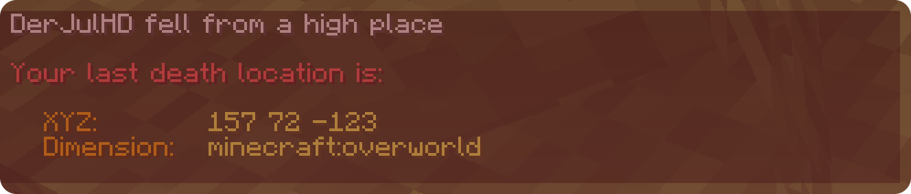
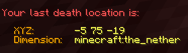
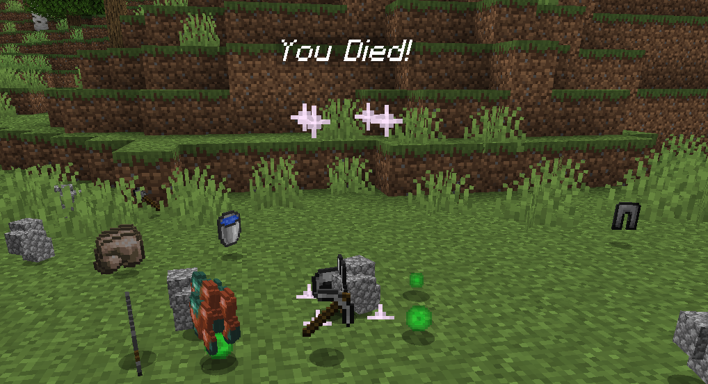

## 📥 Download

  
## 🗒️ Description
This **datapack** for Minecraft Java Edition gives you the possibility to display your "Last Death Location" after death in the chat. It displays the **coordinates**, the **dimension (mod compatible)** and creates a particle cuboid. The gamerule "doImmediateRespawn" must be disabled. If not, it will be disabled during installation and re-enabled after uninstallation. This datapack is somewhat a **cheat**, so be sure you want to use it. Otherwise use the Recovery Compass (vanilla item) instead of the datapack.
  
## ⌨️ Commands
### Users:
- `/trigger -deathlocation` displays your last death location in the chat
- `/trigger -deathsettings` displays the settings menu in the chat
### Operators:
- `/function lastdeathlocation:update` prepares the datapack for updating to a newer version of the datapack (retains all settings)
- `/function lastdeathlocation:uninstall` prepares the datapack for uninstallation (removes every scoreboard, etc.)
  
## 🌍 Languages
- English *(default language)*
- German
  
## 📷 Gallery

  
##

This repository is mainly used for navigation and issue tracking.

