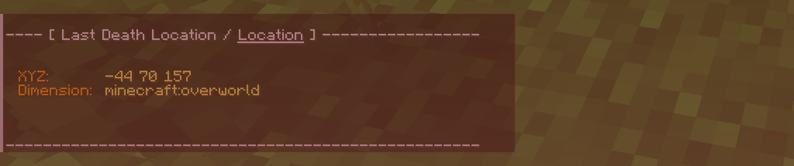

# Last Death Location

## 📥 Download

## 🗒️ Description
"Last Death Location" is a data pack for Minecraft Java Edition that allows players to view recent death locations. These locations can be accessed via the menu. The history can store up to 16 recent deaths. The data pack also offers several options to customize the player's experience. As there is no need for a "Recovery Compass" to view the last death location, some may consider this data pack as a form of **cheat**.

## 🔍 Useful Resources
- 📖 [**Wiki**](https://github.com/fixyldev/LastDeathLocation/wiki): For comprehensive data pack information.
- ❓ [**FAQ**](https://github.com/fixyldev/LastDeathLocation/wiki/FAQ): Find answers to frequently asked questions.
- 🐛 [**Issues**](https://github.com/fixyldev/LastDeathLocation/issues): For reporting bugs or suggesting features.
- 📝 [**Changelog**](https://modrinth.com/datapack/last-death-location/changelog): Keep track of all notable changes made to the data pack.
